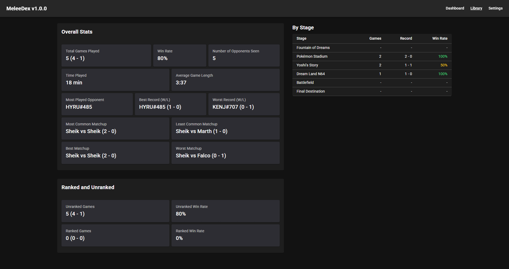

# MeleeDex

**Who is this? Have we played before? How did it go?**

MeleeDex watches your Slippi replay folder. When a game starts, it tells you
whether you have played this person before, what your record against them is,
and how this matchup and stage have gone for you — while the game is on screen.

Between games it is a record of your whole library: your overall record, who you
play most, your best and worst matchups, and how much Melee you have actually
played.



## Installing

Download the latest `MeleeDex_<version>.exe` from
[Releases](https://github.com/jakeyizle/melee-dex/releases/latest) and run it.
Windows only, 64-bit.

> **Windows will warn you the first time.** The installer is not code-signed
> yet, so SmartScreen shows "Windows protected your PC". Click **More info** →
> **Run anyway**. The same warning appears when the app updates itself. If you
> would rather not, you can build it yourself — see below.

MeleeDex updates itself: when a new version is released it downloads in the
background and installs the next time you close the app.

## First run

1. **Point it at your replays.** Open the Slippi Launcher, click the gear icon,
   choose **Replays**, and copy the path under _Root SLP Directory_. Paste that
   into MeleeDex's Settings.
2. **Wait for the import.** Every replay is read once. A large library takes a
   while, and the progress bar tells you how far along it is.
3. **Tell it who you are.** Enter your connect code (the `ABCD#123` next to your
   name in the Launcher). You can skip this — MeleeDex works out which player is
   you the first time you start a game, as long as your library makes it
   obvious.

Then play. The dashboard switches to the live view on its own.

## What it shows

**During a game** — who the opponent is, any other names they have played
under, your record against them, the ranked and unranked split, your record in
this exact matchup and on this stage, and your last few games against them.
If you have never played them, it says so, which is usually the thing you
wanted to know.

**Any time** — the Library tab: your overall record and win rate, how many
opponents you have faced, who you play most, your best and worst records and
matchups, time played, your record on each tournament-legal stage, and which
replays were skipped and why.

## Notes

- **Only singles matters.** Games that are not two human players — matches
  against a CPU, anything that is not 1v1 — are skipped, along with games under
  30 seconds and replays with no connect codes. The Library lists what was
  skipped and why.
- **Ranked and unranked are counted separately**, as well as together. Only
  ranked games form sets; unranked games each stand alone.
- **Nothing leaves your machine.** Replays are read from disk and stored
  locally. There is no account, no server, and no telemetry.
- **Changing your replay folder starts over.** The old library is cleared, since
  statistics spanning two folders cannot be told apart.

## Building it yourself

```sh
npm install
npm run dev     # Vite + Electron, with devtools
npm run build   # typecheck, bundle, and package an installer into release/
```

Tests:

```sh
npm test            # the unit and component suite
npm run test:e2e    # Playwright specs against the built app
npm run test:coverage
```

`CLAUDE.md` (and the ones in `src/` and `electron/`) describe the architecture,
the invariants worth knowing, and the reasoning behind the awkward parts.

## Licence

MIT — see [LICENSE](LICENSE).
